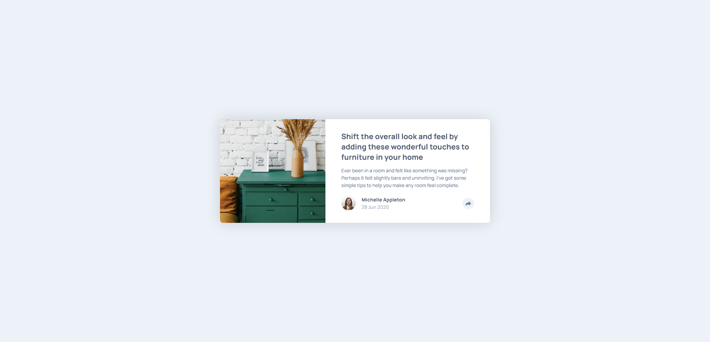
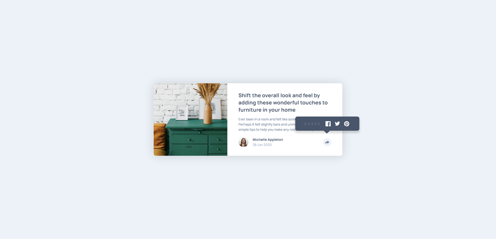

# Frontend Mentor - Article preview component solution

This is a solution to the [Article preview component challenge on Frontend Mentor](https://www.frontendmentor.io/challenges/article-preview-component-dYBN_pYFT). Frontend Mentor challenges help you improve your coding skills by building realistic projects. 

## Table of contents

- [Overview](#overview)
  - [The challenge](#the-challenge)
  - [Screenshot](#screenshot)
  - [Links](#links)
- [My process](#my-process)
  - [Built with](#built-with)
  - [Useful resources](#useful-resources)
- [Author](#author)

**Note: Delete this note and update the table of contents based on what sections you keep.**

## Overview

### The challenge

Users should be able to:

- View the optimal layout for the component depending on their device's screen size
- See the social media share links when they click the share icon

### Screenshot

### Links

- Solution URL: [github](https://github.com/samy-ard/article-preview/)
- Live Site URL: [github page](https://samy-ard.github.io/article-preview/)

## My process

### Built with

- Semantic HTML5 markup
- CSS custom properties
- Flexbox
- Mobile-first workflow
- [jQuery](https://code.jquery.com/jquery-3.6.1.min.js) - JS library

### Useful resources

- [Stackoverflow](https://stackoverflow.com/questions/25065661/how-to-position-a-css-triangle-using-after) - This helped me with the arrow/chevron of social share dialog box for desktop design.

- [jQuery](https://api.jquery.com/toggle/#toggle-duration-complete) - This helped me with hidding and displaying the share dialog box.

## Author

- Frontend Mentor - [@samy-ard](https://www.frontendmentor.io/profile/samy-ard)

